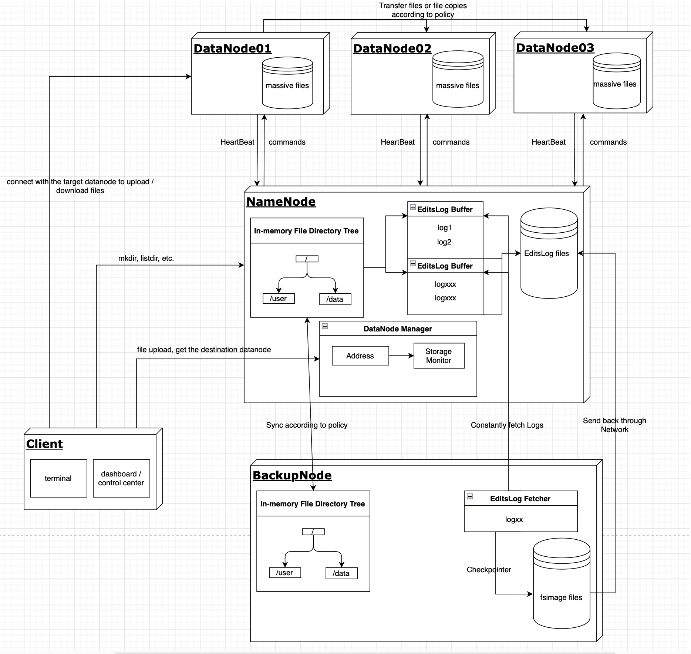

# MassiveFileStore: A Distributed System for Storing Large Numbers of Small Files

MassiveFileStore is a distributed storage system developed in Java to store billions of small files that have sizes up to 10 MB each. The data stored includes contract documents, tickets, attachments, audio or video files from various businesses. These non-structured data cannot be saved in MySQL databases due to their high volume, so they need to be managed by specialized systems designed specifically for this purpose. It fills these needs while also ensuring security and reliability through its robust design and implementation.

## Key Features

- **Scalability** - Designed as a clustered system that can easily scale to handle increasing data volumes by adding commodity servers
- **Availability** - No single point of failure, supports automatic failover, and reconstructs state after failures
- **Performance** - Optimized for high throughput ingest and retrieval of many small files
- **Cost Effective** - Runs on commodity hardware and open source software like Linux and Java

## Business Scenario & Limitations of Existing Technologies

Banks need to store a large number of contract files, transactions, tickets, ticket attachments, and multimedia files. These data are unstructured and cannot be stored in MySQL. Moreover, due to their large quantity and high sensitivity, a custom storage system is needed to store this core data.

The main technologies currently available are FastDFS and Hadoop's HDFS. The limitations of these technologies are:

1. FastDFS
   - The open-source community is not active, and updates and maintenance are infrequent.
   - The current version has many bugs, and security cannot be guaranteed.
   - The code is written in C, making it difficult to read the source code and understand the underlying operating principles.

2. HDFS
   - Hadoop is mainly used to split super-large data files (tens of GB) and perform distributed computing on different machines. However, our business scenario involves storing a large number of small files (a few MB) in a specific field.

## Design Choices & Trade-offs

Given the large number of users and the high demand for availability in the industry, these factors should be considered in the design.

### Efficiently Handling Client Requests

Every time a client modifies the file system, it does not directly write to the file directory tree on the namenode disk. Instead, it generates an editsLog and writes it to an in-memory buffer (**editsLog Buffer**) on the namenode. The editsLogBuffer adopts a double buffer design pattern. When one buffer is full, a thread is started to write the current buffer's editsLog to disk, while the new editsLog is written to another buffer, and the two buffers are swapped.

At the same time, a thread on the backupnode continuously sends requests to the namenode to pull editsLog and applies it to the in-memory file directory tree on the backupnode. The backupnode triggers a checkpoint operation every 30 minutes, writing the current file tree and the maximum number of synchronized editsLog to disk, and sends it to the namenode over the network. After receiving the file, the namenode saves it to its own disk.

A thread on the namenode periodically scans the fsimage files on the disk in reverse chronological order, deletes incomplete files (which may be caused by the backupnode writing checkpoint or crashing during transmission), finds the latest complete fsimage, and deletes all previous fsimage files. Then it reads the maximum editsLog number in this fsimage, and deletes the EditLogs files with smaller txId.

### Node Restart Operations and Crash Handling Mechanisms

The namenode graceful shutdown process: all access is prohibited, all editsLog in the memory buffer is written to disk. If the backupnode is currently sending fsimage, it waits until the sending is complete. Requests from the backupnode to pull new editsLog can be rejected (each time the backupnode sends a request to pull editsLog, it will attach a number, telling the namenode to pull the editsLog after this number).

The backupnode graceful shutdown process: wait for the checkpoint process to end, and write the new fsimage file to disk before shutting down.

The namenode restart process: load the saved fsimage, read the maximum editsLog number saved in the fsimage, then read the editsLog file in memory, replay each log after the maximum editsLog number, and continuously update the file directory tree.

When the namenode crashes, how does the backupnode act as a backup node for the namenode?

- When the backupnode starts, it will start a thread (the **AwareConnectHandler** component described below) to listen for dfs-client and datanode connections, report its IP and port number to the namenode, and send a request to get the namenode's configuration information, which is saved in the backupnode's memory (the backupnode and namenode have established a connection).
- When the namenode receives a request from the dfs-client and datanode, it will return the IP and port number of the backupnode as part of the response.
- After the dfs-client and datanode receive the IP and port number of the backupnode, they establish a connection with the backupnode (the dfs-client and datanode have already established a connection with the namenode).
- If the namenode crashes, the dfs-client and datanode will detect it and mark the namenode as crashed in memory.
- After the backupnode detects that the namenode has crashed, it initiates a voting process.
  - The backupnode sends a request to the dfs-client and datanode to collect the status of the namenode saved in their memory.
  - If more than half of the nodes believe that the namenode has crashed, the backupnode automatically upgrades to the namenode.
  - The backupnode program terminates and starts running the namenode process, reading the saved fsimage from the disk, and listening to the port to accept connections from the dfs-client and datanode.
  - After the datanode and dfs-client receive the confirmation signal that the namenode has crashed, they replace the IP address and port number of the namenode saved in memory with the backupnode, and continuously try to establish a connection with the new namenode until they can connect.
  - At this point, the role of the crashed namenode has become a backupnode, which can be handled according to the backupnode crash process.

How to handle when the backupnode crashes?

- If there is no backupnode, the namenode can work normally (only that the editsLog files saved on the disk will continue to accumulate).
- When the backupnode recovers, it will load the fsimage from the disk to restore the in-memory file directory tree, and read the maximum editsLog number saved in the file, then continuously pull new editsLog from the namenode starting from this number.
- Restore the process of generating a new fsimage.

## Design Overview

Distributed Architecture Diagram:



The design of MassiveFileStore is guided by the following key principles:

- **Scalability:** The system is designed to handle a large number of files and can scale horizontally by adding more datanodes to the cluster.
- **Efficiency:** The system uses efficient data structures and algorithms to ensure fast file upload and download speeds, even under heavy load.
- **Reliability:** The system includes mechanisms for handling node failures and ensuring data consistency across the cluster.
- **Usability:** The system provides a user-friendly client interface for interacting with the file system, as well as a web-based frontend for monitoring and control.

## Subsystem Introduction

This system consists of four main parts: namenode, datanode, backupnode, and client.

- **Namenode:** The namenode is the control center of the system. It manages the metadata of the file system, handles requests from clients, and coordinates the datanodes.
- **Datanode:** Datanodes are responsible for storing the actual file data. They communicate with the namenode and with each other to handle file operations and ensure data consistency.
- **Backupnode:** The backupnode provides a backup of the namenode's file directory tree. It periodically generates a snapshot of the file directory tree (fsimage) and sends it to the namenode for quick recovery in case of a namenode failure.
- **Client:** The client runs on the user's machine and provides an interface for interacting with the file system. It handles user authentication and translates user commands into requests to the namenode.

### Namenode

The namenode is the hub of the entire dfs (distributed file system). It includes:

- **NameNodeAPI** component: Accepts and parses network requests sent to the NameNode from all other nodes, and assigns them to the corresponding processing module for processing.
- **UserManager** component: Responsible for user creation, login authentication, logout, user information update and cancellation, management of storage resources occupied by users, etc.
- **Scheduler** component: Schedules all processes running on the namenode according to priority, and fair scheduling between different users.
- **DataNodeManager** component: Manages all datanodes in the cluster, including the registration of newly added datanodes, specifying the datanode for storing new data based on the load of each datanode, confirming the survival of datanodes, and managing file replicas on different datanodes.
- **DiskNameManager** component: Manages the metadata of the file system, including the insertion, deletion, and modification of metadata, and the recovery of metadata after the namenode restarts.

### Datanode

The datanode is the node that stores the file data of the file system. New datanodes can be added to the cluster as needed. It includes:

- **PeerDataNodeManager** component: Responsible for the perception between datanodes, including file transfer between each other, and the management of network connections between datanodes.
- **StorageManager** component: The storage manager of files on the datanode. Each datanode creates two layers of 256 * 256 folders, and the file path is hashed and modulated to be stored in the corresponding folder to prevent the file directory tree depth from being too large.
- **NameNodeClient** component: A component responsible for communicating with the namenode, mainly including sending registration and heartbeat information, reporting file replica information, etc.
- **DataNodeServer** component: Used to establish a netty network link with the DFS-Client, and is the server for uploading and downloading files.

### Backupnode

The backupnode is used to periodically backup the file directory tree in the namenode and generate fsimage for quick recovery after the namenode restarts.

- **AwareConnectHandler** component: Automatically perceives the connection of dfs-client and datanode,
- **InMemoryFileSystem** component: In-memory file system, using Treeset to maintain the file tree.
- **NameNodeClient** component: A component responsible for communicating with the namenode.
- **FsImageCheckPointer** component: A background process that runs regularly, responsible for generating a new fsimage and sending it to the namenode, and deleting the previous fsimage.
- **EditsLogFetcher** component: Continuously fetch new editsLog from the namenode.

### Client

The client runs on the client side. The main function is user permission verification, accepting user input (command line input or front-end button events) and sending corresponding instructions to the namenode.

- **FileSystem** component: Provides interfaces for creating directories (`mkdir`), uploading files (`put`), downloading files (`get`), deleting files (`remove`), reading file properties, getting file lists in directories, reading datanode storage information, calculating file sizes, etc.
- **DfsCommand** component: Console, mainly responsible for user permission verification, accepting user input.
- **CommandReader** component: Parses user input and calls the interface in the FileSystem component.

### Frontend

The frontend interface is written in React, including the login interface, control center, notification center, etc.

- Control Center: The entry point for users to operate the file system.
- Notification Center: Monitor the capacity of the storage system and the completion progress of user historical operations.

## Protocols

This project requires a lot of network communication, so two main communication protocols have been established.

### Network Transmission Protocol


The structure of the request header is `Map<String, String>`, which is serialized by protobuf and written into the header. The body is the serialized message body, and the data structure is `byte[]`.

### File Chunk Transmission Protocol

There are several scenarios in the cluster that require file transmission, such as uploading, downloading files is the client and DataNode between the file transmission, BackupNode and NameNode between the need to FsImage file transmission. So a file transfer protocol was designed. The network packet of file transfer includes packet type, file metadata, file content binary data, as shown in the figure:


In poor network conditions, chunked file transmission is a more efficient way. The process diagram is as follows:


## Performance Testing

Performance testing is a critical aspect of any system's development and deployment. It ensures that the system can handle the expected load and helps identify any bottlenecks or performance issues that might impact the user experience or system stability.

For MassiveFileStore, we conducted extensive performance testing to ensure that it can handle a large number of small files efficiently. We used a variety of tools and methodologies to simulate different load scenarios and measure the system's response.

Our performance testing focused on the following key areas:

- **File Upload and Download Speeds:** We measured the time it takes to upload and download files of various sizes to and from the system. This helped us understand the system's efficiency in handling file transfers.

- **System Throughput:** We tested the number of file operations (such as uploads, downloads, deletions, etc.) the system can handle per unit of time. This gave us an idea of the system's capacity and helped us identify any potential bottlenecks.

- **Concurrency Handling:** We simulated multiple users accessing the system simultaneously to see how it handles concurrent requests. This is particularly important for a distributed system like MassiveFileStore, where many users may be interacting with the system at the same time.

- **System Stability and Resource Usage:** We monitored the system's stability and resource usage (CPU, memory, network, etc.) under different load conditions. This helped us ensure that the system remains stable even under heavy load and does not consume excessive resources.

The results of our performance testing were highly satisfactory. MassiveFileStore demonstrated excellent performance in handling a large number of small files, with fast upload/download speeds, high throughput, efficient concurrency handling, and stable operation under load. The detailed results and performance graphs can be found in the `performance` directory of the project repository.


## Deployment

Deploying a distributed system like MassiveFileStore involves setting up multiple components across different machines or containers. We provide support for two popular deployment methods: Docker Compose and Kubernetes.

### Docker Compose

Docker Compose is a tool that allows you to define and manage multi-container Docker applications. It's particularly useful for development and testing environments where you need to quickly spin up and tear down instances of your application.

To deploy MassiveFileStore using Docker Compose, follow these steps:

1. **Install Docker and Docker Compose:** Ensure that you have Docker and Docker Compose installed on your machine. You can download them from the official Docker website.

2. **Clone the Repository:** Clone the MassiveFileStore repository to your local machine.

3. **Navigate to the Project Directory:** Use the terminal to navigate to the directory where you cloned the MassiveFileStore repository.

4. **Run Docker Compose:** Run the following command in your terminal:

   ```bash
   docker-compose up
   ```

   This command will start all the services defined in the `docker-compose.yml` file. You can now interact with the system using the client interface.

### Kubernetes

Kubernetes is a powerful platform for managing containerized applications at scale. It provides features like automatic scaling, self-healing, service discovery, and load balancing, making it a great choice for deploying MassiveFileStore in a production environment.

To deploy MassiveFileStore on Kubernetes, follow these steps:

1. **Set Up a Kubernetes Cluster:** You need a running Kubernetes cluster to deploy MassiveFileStore. You can set up a cluster on your local machine for testing purposes using tools like Minikube or kind, or use a managed Kubernetes service from a cloud provider for a production environment.

2. **Install and Configure kubectl:** kubectl is the command-line tool for interacting with Kubernetes clusters. Make sure it's installed on your machine and configured to communicate with your Kubernetes cluster.

3. **Clone the Repository:** Clone the MassiveFileStore repository to your local machine.

4. **Navigate to the Kubernetes Configuration Directory:** In the repository, there's a `k8s` directory containing the Kubernetes configuration files for MassiveFileStore. Use the terminal to navigate to this directory.

5. **Apply the Configuration Files:** Run the following command in your terminal:

   ```bash
   kubectl apply -f .
   ```

   This command will create all the necessary Kubernetes resources (like Deployments, Services, etc.) to run MassiveFileStore on your cluster. You can now interact with the system using the client interface.

Remember to monitor your deployment regularly to ensure its health and performance. Tools like Kubernetes Dashboard and Prometheus can help you keep an eye on your Kubernetes resources and application metrics, respectively.

## Development

Here's the steps to build and test on your local development environment.

Prerequisites:

- Java 8+
- Maven

Compile:

```bash
mvn compile
```

Run unit tests:

```bash
mvn test
```

Start a multi-node cluster:

```bash
# Start NameNode
bin/start-namenode.sh

# Start DataNode 
bin/start-datanode.sh <namenode-host>

# Run client
bin/dfsclient.sh 
```

## Contributions

MassiveFileStore is Apache 2.0 licensed and accepts contributions via GitHub pull requests.

Some areas that need your contributions:

- Additional replication policies
- Node affinity/anti-affinity placement
- Node decommissioning
- Improved caching
- Compression

## References

MassiveFileStore draws ideas from the following great publications:

- [The Google File System 竊余(https://research.google/pubs/pub51/)
- [Apache Hadoop 竊余(https://hadoop.apache.org)
- [Haystack 竊余(https://dl.acm.org/doi/10.1145/3299869.3319875)
- [Log-structured Merge Trees 竊余(https://citeseerx.ist.psu.edu/viewdoc/download?doi=10.1.1.44.2782&rep=rep1&type=pdf)


## Developer Logs

- 2023.6.2 Project start, get initial Java code running.
- 2023.6.4 DataNodes can send registration and heartbeat requests to central NameNode and get corresponding responses.
- 2023.6.5 Implemented the Recovery mechanism on NameNode for DataNode crashes.
- 2023.6.8 Finished the in-memory INode directory structure (the file system namespace) on NameNode.
- 2023.6.10 Double buffer for EditLog
- 2023.6.13 Fixed the sync issues when massive threads writing into editlog buffer and sync to disks when the buffer is full.
- 2023.6.14 - 18 Performance test stage 1
  
